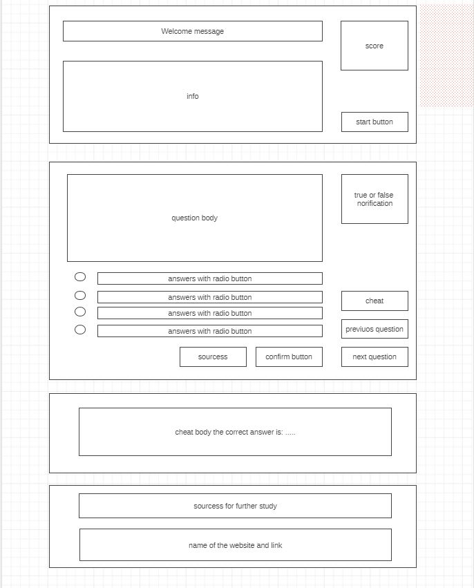

# JavaScript Quiz

This is a simple website in which users can check their JS knowledge by taking a quick quiz.

---

## 0.Setup

- Start a repo.
- Devise a development strategy.
- Design a simple wireframe to set guidelines for UI/UX design.

---

## WIREFRAME

## 1.User Story: Welcome Message

__As a user I want to see a welcome message and brief information about the quiz and rules__

### REPO

- This user story is developed on branch `welcome-message`.
- This branch is merged to `master` branch after completion.

### HTML

- A `<section>` element to contain the welcome message and the information.
- A `<h1>` element for welcome message.
- A `<ul>` and nested `<li>` tags for the rules.
- A `<button>` element to start the quiz.

### CSS

- CSS rules for layout.
- CSS rules for styling.

### JS

#### Listener

- A listener function attached to start `<button>` which will trigger a handler function that calls related functions to read data from state and render the quiz question for display. 

---

## 2.User Story: Question Display

__As a user I want to see a quiz question and answers and a confirm button.__

### REPO

- This user story is developed on the branch `question-display`
- This branch is merged to the `master` branch after completion.

### JS

#### DATA

- A question object that will store all necessary data regarding each question as values and keys; question text,array of answers, url and text for links, index of correct answer, index of users answer.
- An Array to store all question objects.

#### VIEW

- A function which reads related data from question object, renders it in HTML and appends that HTML to a container `<main>` element with an ID of `interface` on the page.
- An HTML template for the question data to be rendered, which contains;
  - a `
` element for question body, 
  - `<input type="radio">` for each answer with a `value` attribute equals to index of the answer to be able to track correct and false answers.
  - a `<button>` element for user to be able to confirm his answer.
 

### CSS

- CSS rules for layout.
- CSS rules for styling.

---

## 3.User Story: Choose an Answer

__As a user I want to be able to choose an answer and see if it's correct or not__

### REPO

- This user story is developed on branch `question-answer`.
- This branch merged to `master` branch after completion. 

### JS

#### Listener

- A listener function attached to the interface `<main>` element listening for a `click` event and calls handler function if the target of the click event is confirm button.

#### Handler

- A function which, in case of event target is confirm button;
  - reads the value of `<input type="radio">` selected by the user,
  - reads the index of correct answer of the current question from the question object.
  - updates question object.
  - checks if answer is correct or false.
  - displays the user if answer is wrong or correct.

#### VIEW

- A function that renders a green tick sign if answer is correct or red x sign if answer is wrong to be displayed to user.

---

## 4.User Story: Display Score

__As a user I want to see my score updated after every answer__

### REPO

- This user story is developed on the branch `score-display`.
- This branch is merged to the `master` branch.

### JS

#### DATA

- A state object which contains a `key` named `correct` to keep track of correct answers.
- Move questions array into the state object.

#### Logic

- A function which loops trough the questions array and checks if the index of the correct answer and the index of the user answer matches for every question object, returns the number of matches and updates the value corresponding to the `key` named `correct` inside state object.
- A function that reads the number of correct answers and calculates the score.

#### VIEW

- A function that reads the score from from the return value of the function which calculates the score and updates the inner HTML of the score display section n the page. 

#### Handler

- Add a snippet of code confirm handler function, so after every click to the confirm `<button>`, handler function calls the function which calculates and updates the user score.

- Add a snippet of code confirm handler function, which calls the function that renders and displays the score

### CSS

- CSS rules for the layout of score display.
- CSS rules for the styling of score display.

---

## 5.User Story: Cheat

__As a user I want to be able to cheat and see the correct answer__

### REPO

- This user story is developed on the branch `cheat`.
- This branch is merged to the `master` branch after completion.

### JS

#### VIEW

- Add a `<button>` element to the HTML template for the display of question which will trigger a function that reveals the correct answer.
- A function which reads the correct answer from the question object nested inside the state object, creates a HTML template consist of a container `
` element, a `
` element and a `` nested inside of it to be able to dynamically display the correct answer. 

#### LISTENER

- An event listener attached to the interface `<main>` element listening for the click events and calls the handler function if the target of the click event is the cheat `<button>`.

#### HANDLER

- A function that calls the function which creates HTML template for the correct answer and appends its return value to container `<section>` element.

### CSS

- CSS rules for the layout.
- CSS rules for the styling.

---

## 6.User Story: Study Resources

__As a user I want to be able see resources to study on each question__

### REPO

- This user story is developed on the branch `study-resources`.
- This branch is merged to the `master` branch after completion.

### JS

#### VIEW

- Add a `<button>` element to the HTML template for the display of question which will trigger a function that reveals the name and the link of the study resource.
- A function which reads the correct answer from the question object nested inside the state object, creates a HTML template consist of a container `
` element, a `
` element and a `` with an `<a>` tag for the link nested inside of it to be able to dynamically display the study source. 

#### LISTENER

- An event listener attached to the container section listening for the click events and calls the handler function if the target of the click event is the study resources `<button>`.

#### HANDLER

- A function that calls the function which creates HTML template for the study resources and appends its return value to interface `<main>` element.

### CSS

- CSS rules for the layout.
- CSS rules for the styling.

---

## 7.User Story: Switch Questions

__As user I want to be able to jump to next question and return to previous one.__

### REPO

- This user story is developed on the branch `switch-questions`.
- This branch is merged to the `master` branch after conpletion.

### JS

#### DATA

- Add state object a `key` with a name of `currentQuestion` to be able to track the index of the current question inside the questions array nested inside state object.

#### VIEW

- Add two `<button>` elements to the HTML template rendered by the function for the display of questions one for next and one for previous.

#### LISTENER

- Attach an event listener to the interface `<main>` element listening for clicks.
- Call next question handler function if the target of the click event is the next `<button>`.
- Call previous question handler function if the target of the click event is the previous `<button>`.

#### HANDLER

- A function which increases the value of `currentQuestion` by one and calls the question display function.
- A function which decreases the value of `currentQuestion` by one and calls the question display function.

---

## 8.User Story: Quit

__As a user I want to be able to quit from the quiz whenever I want and see my results.

### REPO

- This user story is developed on the branch `quit`.
- This branch is merged to the `master` branch after completion.

### JS

#### VIEW 

- Add a `<button>` element to the HTML template rendered by the question display function.
- A new function that reads the `answered` and the `correct` properties from the state object and renders an HTML template consisting a container `
`, an `<h2>` for good bye message and three `` tags for total answered questions, number of correct answers and final score.

#### LISTENER

- A function that listens the `interface` section for click events and triggers the quit handler function if the target of the click event is the quit button.

#### HANDLER

- A handler function that calls the function which calls the the function that renders the inner HTML of the good bye section and changes the inner HTML of the interface section with the inner HTML of the good bye page.

### CSS

- CSS rules for layout
- CSS rules for styling

## 9.User Story: Developer Logs

__As a developer I would like to see logs of every user interaction__

### REPO

- This user story is developed on the branch `developer-logs`.
- This branch is merged to the `master` branch after completion.

### JS

#### DATA

- Create a log.js file and `stateLogs` array.

#### HANDLERS

- Add every handler function code snippet that defines a log object and stores the name of the user action, event, deepclone of the state object, user input, output that will be displayed to user as key value pairs and push that log object to the `stateLogs` array inside the log.js file.

---

## 10.User Story: Finishing Touches

### REPO

- This user story is developed on the branch `finishing-touches`.
- This branch is merged to the `master` branch after completion.

- Fixes and upgrades

